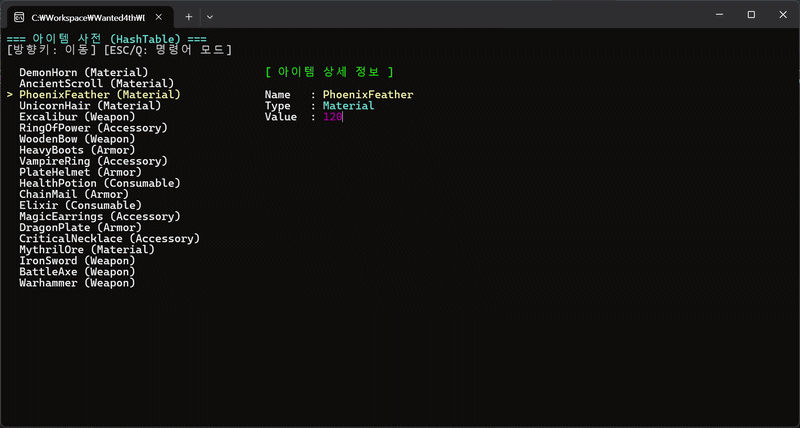
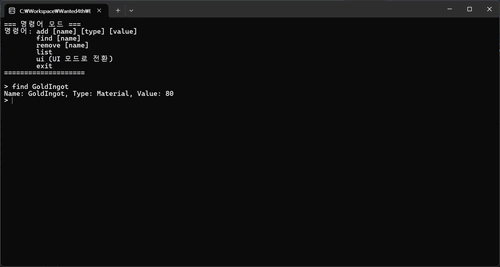
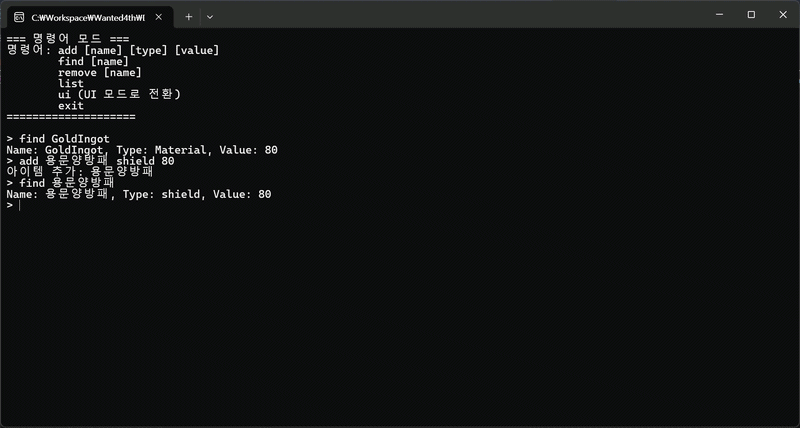

## 원티드 4기 실습 프로젝트 2: 아이템 사전 프로그램

### 목적
- 비선형 자료구조 직접 구현(해시테이블 or 이진 탐색 트리) 경험

### 회고
[HiImKwak.blog - C++ 기본기 연습 프로젝트: 아이템 사전 프로그램](https://hiimkwak.blog/game-dev/study/2026/03/04)

### 구현
- 프로젝트 1 기능(사전 원형 탐색) 추가

- `add()`, `find()`

- `remove()`

